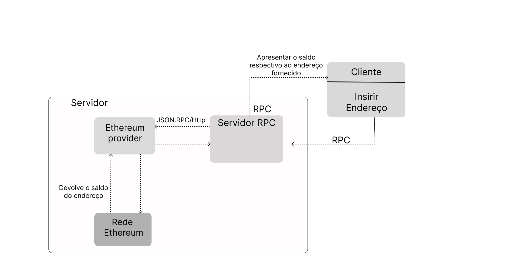
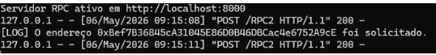
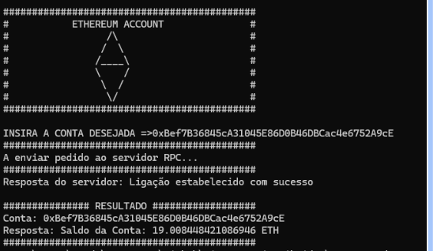
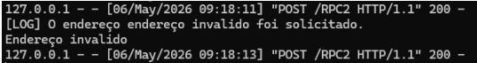
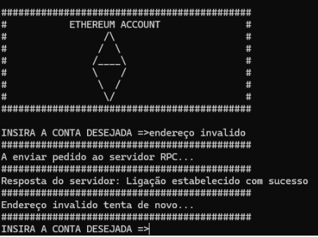

Relatório do Trabalho prático
Sistemas Distribuídos

Licenciatura em Engenharia Informática

<SRPCSE>

Aluno: Jordy Lima, 1707765, 
     Jordy-j-l, jordylima2003@gmail.com

1. Descrição do Trabalho	3
2. Implementação do Trabalho	3
3. Funcionamento do trabalho	3
4. Conclusão	3
Bibliografia	3

Descrição do Trabalho
Neste trabalho desenvolvi um sistema distribuído baseado em RPC que permite consultar o saldo de uma conta Ethereum. O cliente introduz um endereço Ethereum, envia esse endereço ao servidor através de XML-RPC e o servidor consulta o saldo através da API do Etherscan. No final, o saldo é devolvido ao cliente e apresentado no terminal.
A ideia principal do trabalho foi aplicar o modelo cliente-servidor em contexto de Sistemas Distribuídos. O cliente não consulta diretamente a rede Ethereum; em vez disso, comunica com o servidor RPC, que fica responsável por validar o pedido, consultar a fonte externa e devolver a resposta.

Implementação do Trabalho	
A implementação foi feita em Python e foi dividida em dois ficheiros principais: server.py e cliente.py. Também incluí o ficheiro requirements_1707765.txt com a ordem de execução pedida.
Durante o desenvolvimento, comecei por implementar uma comunicação RPC mínima com uma função ping(), para garantir que o cliente conseguia comunicar com o servidor. Depois implementei a função obterSaldo(endereco), a validação do endereço Ethereum e a consulta externa ao saldo.

2.1. Servidor RPC
No servidor usei o módulo SimpleXMLRPCServer para criar um servidor XML-RPC em localhost na porta 8000. A função ping() foi mantida como teste de comunicação e a função obterSaldo(endereco) ficou responsável pelo funcionamento principal do trabalho.
•Receber o endereço enviado pelo cliente.
•Registar no terminal do servidor que aquele endereço foi solicitado.
•Validar se o endereço tem o formato correto.
•Consultar a API do Etherscan caso o endereço seja válido.
•Converter o saldo recebido em wei para ETH.
•Enviar a resposta ao cliente.
2.2. Cliente RPC
No cliente usei ServerProxy para criar a ligação ao servidor RPC. O cliente apresenta um menu simples em modo terminal, pede ao utilizador o endereço Ethereum e envia o pedido ao servidor. Caso o endereço seja inválido, o cliente volta a pedir um novo endereço.
2.3. Validação do endereço Ethereum
Antes de consultar o saldo, implementei uma validação básica do endereço Ethereum. Esta validação evita pedidos desnecessários à API quando o endereço está claramente errado.
•O endereço tem de começar por "0x".
•O endereço tem de ter 42 caracteres no total.
•Depois do prefixo "0x", todos os caracteres têm de ser hexadecimais: 0-9, a-f ou A-F.

def valEndereco(endereco):
    if not endereco.startswith("0x"):
        return False
    if len(endereco) != 42:
        return False
    hex_chars = "0123456789abcdefABCDEF"
    for c in endereco[2:]:
        if c not in hex_chars:
            return False
    return True

2.4. Consulta à API do Etherscan
Inicialmente testei a ligação a um provider local com Ganache e Web3, mas para a versão final optei por usar a API do Etherscan para obter saldos reais da rede Ethereum diacordo com a arquitetura apresentada. Esta API devolve uma resposta em JSON com os campos status, message e result. O valor result corresponde ao saldo em wei, por isso tive de converter esse valor para Ether.
Exemplo lógico do pedido feito pelo servidor:
parametros = {
	"module": "account",
	"action": "balance",
	"address": endereco,
	"tag": "latest",
	"apikey": ETHERSCAN_API_KEY
}

resposta = requests.get(ETHERSCAN_URL, params=parametros)
dados = resposta.json() 
A conversão do saldo foi feita com a relação:
 

Funcionamento do trabalho	
Para executar o trabalho, comecei por instalar a biblioteca requests, que é necessária para o servidor comunicar com a API do Etherscan. Depois executei primeiro o servidor e, em seguida, o cliente.
Ordem de execução:
py -m pip install requests
py server.py
py cliente.py 

Quando o servidor é iniciado, fica à espera de chamadas RPC na porta 8000. O cliente apresenta o menu, pede um endereço Ethereum e envia esse endereço para o servidor.
Server.py

📷 endereço correto:

Cliente.py

📷 Cliente válido:

Também testei o comportamento com endereços inválidos. Quando o endereço não começa por 0x, não tem 42 caracteres ou contém caracteres não hexadecimais, o servidor devolve False e o cliente volta a pedir um novo endereço.
📷 endereço inválido:

📷 Cliente inválido:

Exemplo de validação:
•	dhdksaj7: inválido, porque não começa por 0x e não tem o tamanho correto.
•	0xjsandjsnadksd: inválido, porque contém letras fora do conjunto hexadecimal e tem tamanho incorreto.
•	0x71C7656EC7ab88b098defB751B7401B5f6d8976F: válido, porque respeita o formato de endereço Ethereum.

Conclusão
Neste trabalho implementei um sistema distribuído simples para consulta de saldos de contas Ethereum através de RPC. O objetivo principal foi cumprido: o cliente envia um endereço ao servidor, o servidor valida o endereço, consulta o saldo através de uma API externa e devolve o resultado ao cliente.
Durante o desenvolvimento compreendi melhor a diferença entre o cliente, o servidor e o provider externo. Também percebi que a serialização entre cliente e servidor é feita automaticamente pelo XML-RPC, enquanto a comunicação com o Etherscan usa JSON.
O sistema ficou funcional e alinhado com a arquitetura definida. Como melhoria futura, poderia proteger a API key com variáveis de ambiente, adicionar uma interface gráfica e melhorar o tratamento de erros da API.

Bibliografia
[1] Paulo Vieira, Leitura 7 - Servidor RPC em Python, material da unidade curricular de Sistemas Distribuídos.
[2] Paulo Vieira, Leitura 3-B - JSON, material da unidade curricular de Sistemas Distribuídos.
[3] Paulo Vieira, Leitura 10B - Web Services, material da unidade curricular de Sistemas Distribuídos.
[4] Paulo Vieira, Leitura 3-A - Sistemas Distribuídos, material da unidade curricular de Sistemas Distribuídos.
[5] Etherscan, API Reference - Get Native Balance for an Address, https://docs.etherscan.io/api-reference/endpoint/balance
[6] Python Software Foundation, xmlrpc.server - Basic XML-RPC servers, https://docs.python.org/3/library/xmlrpc.server.html
[7] Python Software Foundation, xmlrpc.client - XML-RPC client access, https://docs.python.org/3/library/xmlrpc.client.html

